# Kosh-AI — Procurement Intelligence Engine

> AI-powered procurement intelligence for merchants. Upload invoices, compare suppliers, and get smart recommendations powered by OCR and value scoring.
 
 ### 🧠 The Intelligence Moat
 Kosh-AI is not an OCR product. It is a **procurement intelligence network**. Every invoice strengthens the system’s pricing accuracy for all users. Over time this creates the largest proprietary dataset of real supplier pricing — a dataset competitors cannot access or reproduce.

---

## 🏛 Design Philosophy

This architecture exists because **merchant procurement intelligence is fundamentally a data quality problem**, not a performance problem.

### 1. Separation of synchronous and asynchronous work
Uploading an invoice takes milliseconds. Processing it through OCR, validating output, matching SKUs, and scoring suppliers takes 5–30 seconds. FastAPI handles the fast path (upload, status check). Celery handles the slow path (heavy lifting). Neither blocks the other, ensuring a smooth UX even under heavy load.

### 2. PostgreSQL over NoSQL
Invoice data is deeply relational. An item belongs to an invoice, links to a product, maps to a supplier, generates a score and a recommendation. Relational integrity isn't optional; a broken foreign key means a broken recommendation. PostgreSQL enforces this structurally.

### 3. Confidence-tiered validation, not blind acceptance
OCR output ranges from perfect to garbage. Instead of treating all output equally, the system classifies it into three tiers:
- **Auto-Accept (≥85%):** Flows directly to intelligence engines.
- **Needs-Review (60-84%):** Queued for human verification.
- **Reject (<30%):** Hard failure; merchant notified to re-upload.

### 4. Cloud-Native Resilience & CDNs
By migrating from local storage to **Cloudinary**, we ensure:
- **High Availability:** Invoice assets are hosted on a global CDN.
- **Offloaded Processing:** PDF-to-image conversion and optimization are handled by Cloudinary, reducing CPU load on our workers.
- **Persistence:** Assets are decoupled from the container lifecycle.

### 5. Circuit breakers on external dependencies
Google Vision or Cloudinary can fail. When they do, the system fails fast (circuit breaker opens) instead of queuing hundreds of doomed retries. Recovery is tested automatically with half-open states.

### 6. Dead letter queue for terminal failures
When a task exhausts all retries, it isn't lost — it goes to the DLQ for manual inspection or batch reprocessing. No invoice is silently dropped.

**The result:** Most systems treat OCR as "solved." We treat OCR as inherently unreliable and build every downstream process to handle that unreliability gracefully.

---

## 🌍 Why Now

Four macro trends facilitate the success of Kosh-AI:

1. **SMB digitization is accelerating.** India has 63M+ SMBs. UPI, GST, and digital invoicing are pushing them online. Accounting is increasingly digital (Tally, Zoho), but procurement remains gut-driven and manual. Kosh-AI turns that raw data into intelligence.
2. **OCR reliability threshold.** Modern Tesseract v5 and vision heuristics achieve 85-95% accuracy on most formats. That improvement is the difference between a demo and a production-grade tool.
3. **Supplier competition.** Merchants have more options than ever but lack the systems to evaluate them. Kosh-AI allows a merchant to compare 15 suppliers for one category in seconds.
4. **AI adoption buy-in.** Merchants who use Swiggy, Zomato, and Amazon already trust AI-driven recommendations. Kosh-AI's explainable scoring ("Here's *why* we recommend this") meets them where they are.
 
 ---
 
 ## 🚀 Network Intelligence Flywheel
 
 Our platform is built on a self-reinforcing loop that scales as we grow:
 - **More Merchants** → more invoices uploaded.
 - **More Invoices** → better pricing benchmarks.
 - **Better Benchmarks** → sharper recommendations.
 - **Sharper Recommendations** → higher merchant savings.
 - **Higher Adoption** → more merchants join the ecosystem.
 
 ## 🛡 Competitive Defensibility
 
 We are building deep, non-replicable assets that increase in value over time:
 - **Proprietary Invoice Dataset**: Thousands of real transaction points across fragmented supply chains.
 - **Supplier Reliability Graph**: Performance metrics based on real fulfillment cycles that cannot be bought or scraped.
 - **Price Volatility Database**: Historical archives of SKU-level pricing trends and supplier behavior.
 - **Hyper-Local Intelligence**: Regional procurement patterns unique to the Indian supply chain context.
 
 ## 📈 Economic Impact
 
 - **Average SMB Inefficiency**: Merchants overpay by **8–18%** due to information asymmetry and "price creep".
 - **Kosh-AI Target**: Reducing price variance to **<3%** through automated benchmarking.
 - **Merchant Outcome**: Direct bottom-line improvement and protection against unpredictable cost spikes.
 
 ## 🏁 Market Positioning
 
 | Tool | Category | Core Utility | Kosh-AI Advantage |
 | :--- | :--- | :--- | :--- |
 | **Tally / Zoho** | Accounting | Bookkeeping & Taxes | No supplier intelligence or price benchmarking |
 | **Google Lens** | OCR | General Text Extraction | No procurement analytics or matching logic |
 | **Kosh-AI** | **Intelligence** | **Strategic Procurement** | **Proprietary Market Benchmarks & Network Moat** |

---

## 🗺 Customer Journey

```mermaid
flowchart LR
    subgraph Onboarding["Phase 1: Week 1"]
        direction TB
        S1["🏪 Merchant Signs Up"] --> S2["📋 Profile Config\n(GSTIN, OTP-Secured)"]
        S2 --> S3["👥 Initial Supplier List"]
    end

    subgraph Upload["Phase 2: Week 1-2"]
        direction TB
        U1["📸 Upload Invoices\n(Photo / PDF)"] --> U2["🔍 OCR & Storage\n(Cloudinary Pipeline)"]
        U2 --> U3["✅ Human Verification\n(Verification Queue)"]
    end

    subgraph Intelligence["Phase 3: Week 2-4"]
        direction TB
        I1["📊 Spend Analysis\n(Visual Charts)"] --> I2["⭐ Intelligence Scoring\n(Reliability & CV)"]
        I2 --> I3["💡 AI Recommendations\n(Savings Insights)"]
    end

    subgraph Value["Phase 4: Month 2+"]
        direction TB
        V1["✅ Accept Recommendation"] --> V2["💰 Switch Supplier\n(Save ₹₹₹)"]
        V2 --> V3["🔄 Learning Loop\n(Personalized Weights)"]
    end

    Onboarding ==> Upload ==> Intelligence ==> Value

    style Onboarding fill:#1a2a1a,stroke:#22c55e,color:#fff
    style Upload fill:#1a1a2a,stroke:#3b82f6,color:#fff
    style Intelligence fill:#2a1a2a,stroke:#a855f7,color:#fff
    style Value fill:#2a2a1a,stroke:#eab308,color:#fff
```



| Milestone | Timeline | What Happens |
| :--- | :--- | :--- |
| First invoice processed | Day 1 | Merchant sees OCR in action |
| Dashboard populated | Week 1 | Spend breakdown and category split visible |
| First recommendation | Week 2 | System suggests a better/more consistent supplier |
| First accepted saving | Month 1 | Merchant acts on recommendation, saves money |

---

## 📅 Product Roadmap


---

## 🏗 Architecture Detail

### The Stack
- **Frontend**: Next.js 14, TypeScript, React 18, Tailwind CSS, Lucide.
- **Backend**: Python 3.12, FastAPI, SQLAlchemy (Async/Sync).
- **Processing**: Celery 5, Redis 7 (Broker & Result Backend).
- **Database**: PostgreSQL 16.
- **Security**: JWT-based Auth, Bcrypt hashing, 6-digit OTP reset.
- **OCR Engine**: Tesseract (v5) + Heuristic table parsers.
- **Monitoring**: Prometheus, Grafana, Flower.

### Service Matrix
| Service | URL | Role |
| :--- | :--- | :--- |
| **Frontend** | `localhost:3000` | Merchant Dashboard & Auth |
| **Backend API** | `localhost:8000` | Documentation, JWT, Logic |
| **Flower** | `localhost:5555` | Task Monitoring & Celery Health |
| **Grafana** | `localhost:3001` | Infrastructure & ROI Metrics |

---

## 🔍 OCR Pipeline & Validation Logic

Kosh-AI treats every line item as a verification target.

```
Upload → CDN Storage → Celery Queue → OCR Engine
                                         │
                                         ▼
                                  Validation Loop
                                         │
                         ┌───────────────┼───────────────┐
                         ▼               ▼               ▼
                    Auto-Accept     Needs Review      Reject
                    (≥85% conf)    (60-84% conf)     (<30% conf)
                         │               │
                         ▼               ▼
                    SKU Matching    Verification UI
                    & Scoring logic (Human Correction)
```

### Validation Checks:
1. **Numeric Sanity:** `Quantity > 0`, `Price > 0`.
2. **Cross-Check:** `Qty * Price ≈ Total` (5% tolerance).
3. **Total Reconciliation:** Sum of line items ≈ Invoice Total.
4. **Keyword Mapping:** Descriptions are scanned against a heuristic dictionary (Pharma, Food, FMCG) to auto-categorize products.

---

## � Market Intelligence & Value Scoring

The engine uses a weighted sum to rank recommendations:

$$Value Score = 0.30(Credit) + 0.25(Price) + 0.20(Reliability) + 0.15(Friction) + 0.10(Speed)$$

### Score Definitions:
- **Price Consistency:** Calculated using the **Coefficient of Variation** ($std\_dev / mean$) of historical unit prices.
- **Reliability:** Proxy measured by the percentage of invoices that cleared verification without major manual price/qty corrections.
- **Category Inference:** Suppliers automatically inherit the most common category of the items they provide.

---

## 🛡 Fault Tolerance & Failure Recovery

| Failure Mode | System Response |
| :--- | :--- |
| **OCR Timeout** | Celery soft-limit triggers; Task retries with exponential backoff. |
| **API Load Spikes** | Redis-backed sliding window rate limiter (600 req/min). |
| **Worker Crash** | `acks_late=True` prevents task loss; worker re-queues upon reboot. |
| **Cloudinary Down** | Circuit breaker opens; status marked "failed" to prevent queue congestion. |
| **Failed Validations** | Pushed to a review queue with detailed error flags for the admin. |

---

## 📈 Scaling Strategy (Target: 10k+ Merchants)

### 1. Horizontal Worker Scaling
Each worker is context-free. Adding capacity is as simple as:
```bash
docker compose up -d --scale worker=8
```

### 2. Database Optimization
- **Table Partitioning:** Invoices table partitioned by `merchant_id` and `created_at`.
- **Read Replicas:** Analytics queries (Dashboard) routed to read-only replicas to preserve primary write throughput.

### 3. Queue Management
- **Priority Queues:** Merchant uploads assigned `HIGH` priority; background re-scoring assigned `LOW`.

---

## � Security & Compliance

- **Authentication:** JWT with 30-minute rotation and Refresh tokens.
- **Resets:** OTP tokens expire in 10 minutes and use a cryptographically secure random generator.
- **Audit Logging:** Every verification and recommendation acceptance is logged in `activity_logs`.
- **GDPR/DPDPA Ready:** Data reset script allows for complete "Right to be Forgotten" implementation.

---

## 🛠 Developer Guide

### Maintenance Commands
Clear testing data while keeping merchant login:
```bash
docker exec -e PYTHONPATH=. koshai-backend-1 python scripts/reset_data.py
```

Seed market benchmarks:
```bash
docker exec -e PYTHONPATH=. koshai-backend-1 python scripts/import_kaggle.py
```

### Local Development
1. Clone the repo.
2. `cp .env.example .env` (Add Cloudinary keys).
3. `./scripts/run.sh`.

---

**Kosh-AI: Built for Indian Merchants. Built for the data truth.**
# Kosh-AI


